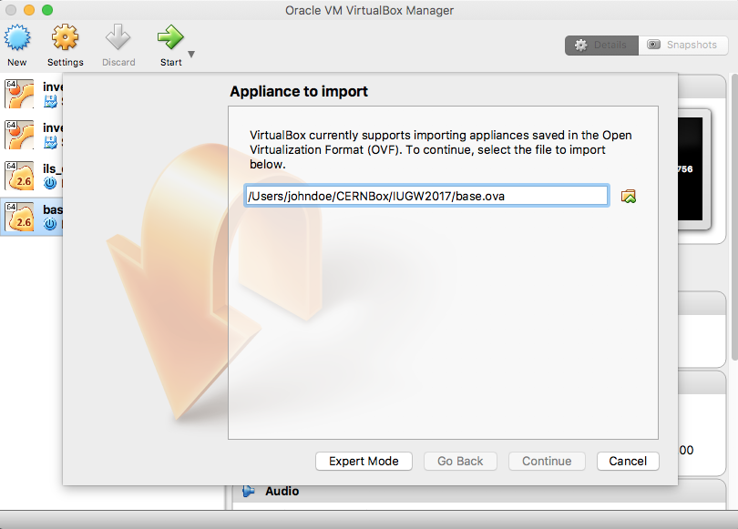
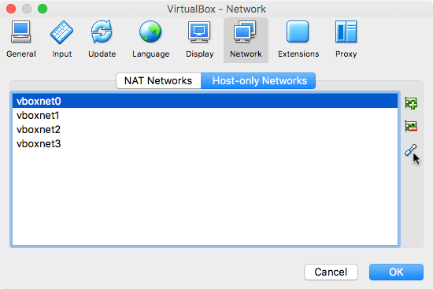
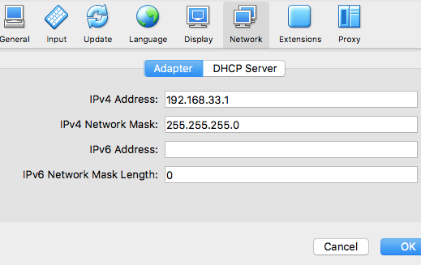
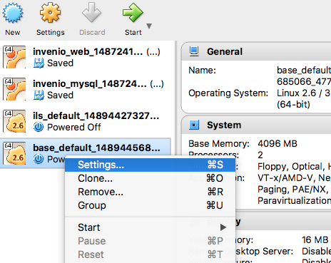
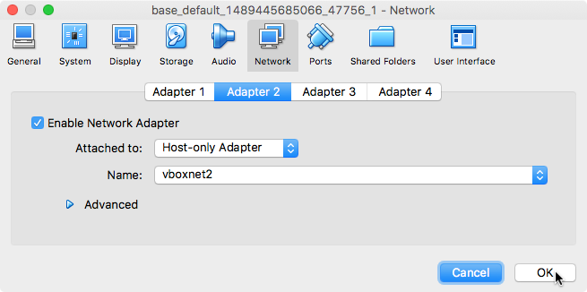

# Prerequisites

The tutorials during IUGW2017 will use VirtualBox with prepared virtual
machines (VMs) in order to ensure that all participants have as homogenous
environment as possible.

### Install VirtualBox

First you need to install VirtualBox which is available for both Linux, macOS
and Windows.

- Go to https://www.virtualbox.org/wiki/Downloads
- Download the latest VirtualBox 5.1.x platform package for your host
 operating system.

For Linux based distributions you can usually install VirtualBox via your
distribution's package manager.

### Download VMs

- Download the VMs (.ova format) from
  [CERNBox](https://cernbox.cern.ch/index.php/s/jUNHec9PyZEGhml)

The CERNBox have two VMs:

- ``base.ova``: Basic VM with only the required dependent services such as
  PostgreSQL, Elasticsearch, RabbitMQ and Redis installed.
- ``ils.ova``: Full installation of Invenio ILS.

### Import a VirtualBox

To import one of the above VMs in VirtualBox follow this small guide:

- Start VirtualBox and open the menu File > Import Appliance...
- Locate the ``.ova`` file for the VM you want to import (e.g. ``base.ova``)
  and click Continue and afterwards Import (the import may take a little
  while).



- Next, open go to Preferences in the menu and select the Network tab and
  afterwards the "Host-only Networks".



- Click the screw-driver icon for each ``vboxnet`` and until you locate the
  vboxnet with the Adapter IP address ``192.168.33.1``. Remember the name of
  the vboxnet (e.g. ``vboxnet2``).



- Afterwards, right click on the import VM and select Settings.



- Go to the "Network tab" and "Adapter 2". Make sure that "Name" says the name
  of the vboxnet you noted down before.



- Next, go to the "Shared Folders" and "Adapter 2". Make sure that "Name" says the name
  of the vboxnet you noted down before.

- You can now boot the VM, and you should be able to SSH into the machine:

  ```console
  $ ssh invenio@192.168.33.3
  ```
